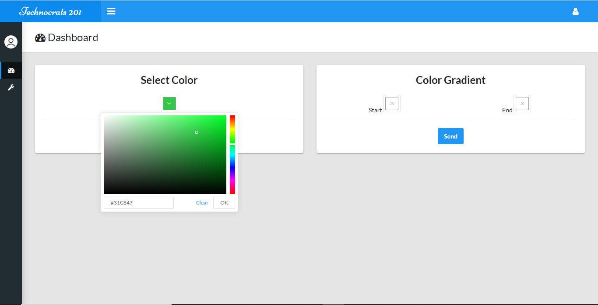

# technocrat-oexcite201-dashboard


## Project setup
```
npm install
```

### Compiles and run
```
npm run serve
```

```
Goto http://localhost:8080
```

### Login (After completing the API setup)
Username: admin

Password: password